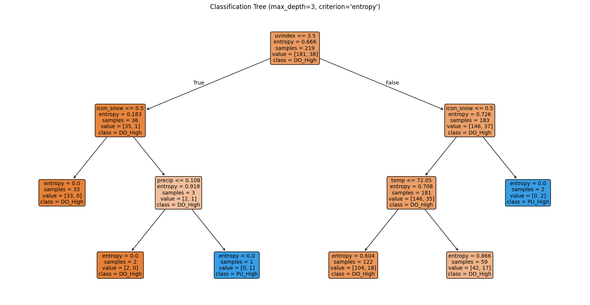
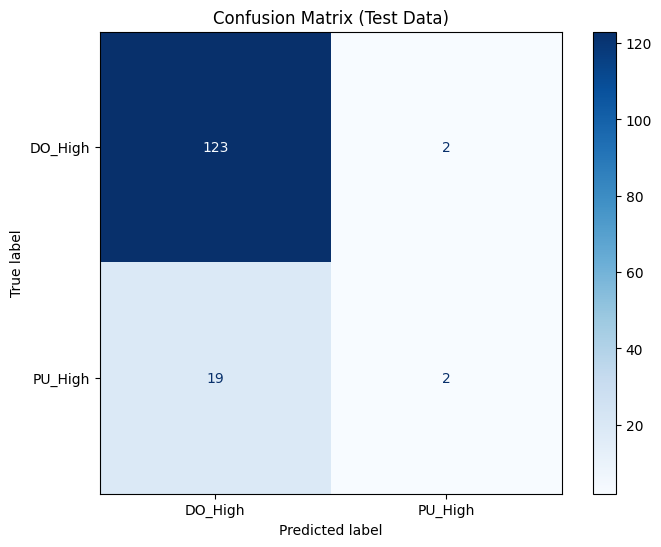

# Capital Bikeshare Demand Analytics & Machine Learning

A professional portfolio project built from **four related MS Business Analytics notebooks** analyzing 2025 Capital Bikeshare morning demand at **22nd & H St NW** near George Washington University.

**Tech:** Python · pandas · NumPy · Matplotlib · scikit-learn  
**Methods:** Linear Regression · KNN · Logistic Regression · SVM · Decision Trees · Confusion Matrix · ROC/AUC · Cross-Validation · Lasso

## Business question

> Can historical bikeshare demand and weather conditions help predict morning pickup/drop-off demand and support better bike/dock allocation decisions?

## Key results

### Regression

| Target | Best source-reported feature set | Test MSE |
|---|---|---:|
| Pickup | Temperature + precipitation | **4.0121** |
| Drop-off | Temperature + precipitation | **20.8469** |

Adding more weather features improved training fit but did not improve test MSE.

### Earlier classification block (`random_state=2026`)

| Model | Test accuracy |
|---|---:|
| KNN, k=6 | **80.82%** |
| Logistic Regression | **80.82%** |
| Linear SVC, C=10 | 80.14% |
| RBF SVC, C=10 | **80.82%** |

### Decision-tree diagnostic block (`random_state=200`)

- Decision-tree accuracy: **85.62%**
- Confusion matrix: **`[[123, 2], [19, 2]]`**
- `DO_High` TPR: **98.40%**
- `DO_High` FPR: **90.48%**





The test set contains 125 `DO_High` and 21 `PU_High` observations. An always-`DO_High` majority classifier therefore also achieves about **85.62% accuracy**. The headline tree accuracy is consequently misleading.

### AUC-based model selection

| Candidate | Mean 5-fold CV AUC |
|---|---:|
| Linear SVM | **0.6144** |
| KNN, k=10 | 0.5140 |
| Decision Tree, depth=3 | 0.5046 |

The selected Linear SVM achieved a source-reported final **test AUC of 0.5425**.

### Lasso

| Target | Selected alpha | Test MSE |
|---|---:|---:|
| Pickup | **0.0494** | **4.2814** |
| Drop-off | **0.2683** | **20.8275** |

## Core analytical lesson

This project demonstrates two important ideas:

1. **More features do not automatically improve generalization.**
2. **High accuracy can be misleading when the target is imbalanced.**

## Repository structure

```text
capital-bikeshare-demand-analytics/
├── README.md
├── notebooks/
│   └── capital_bikeshare_demand_analytics.ipynb
├── images/
├── results/
│   ├── benchmark_results.csv
│   ├── classification_diagnostics.csv
│   └── pickup_lasso_coefficients.csv
├── data/
│   ├── README.md
│   └── raw/
├── requirements.txt
├── .gitignore
└── UPLOAD_CHECKLIST.md
```

## Reproducibility note

The first three source notebooks use `random_state=2026`; the later tree/AUC notebook uses `random_state=200`. The final notebook preserves these separate source-reported result blocks transparently.

A stronger future version should use chronological or rolling validation, training-only hyperparameter tuning, and consistent preprocessing pipelines.

## AI-assistance disclosure

Generative AI tools were used during the original coursework to assist with workflow planning, code drafting/debugging, and written explanations. Model executions, outputs, and interpretations were reviewed by the author. This portfolio version reorganizes the work for reproducibility and professional presentation.

## Author

**Franbon Ahmed**  
MS Business Analytics, George Washington University
